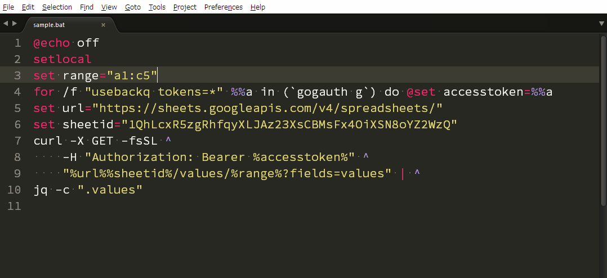

# gogauth

[](https://travis-ci.org/tanaikech/gogauth)
[](LICENCE)

This is a CLI tool to easily retrieve access token for using Google APIs.

# Demo



This is a demo for retrieving values from spreadsheet using Google Sheet API v4. The access token obtained by gogauth is used for this. This is a batch file for windows command prompt.

# Description

One day, I noticed users who feel difficulty for retrieving access token from Google. I thought that if the access token can easily retrieve, users who can use various convenience Google APIs will increase. So I created this. Also this can be used for testing sample script like the demo. If this will be helpful for you, I'm glad.

Features of this CLI tool is as follows.

1. Easily retrieves access token for using APIs on Google.

2. Effectively uses expiration time of access token.

3. Confirms condition of access token. For the access token, you can see expiration time, owner, scopes and client id.

# How to get gogauth

Download an executable file of gogauth from [the release page](https://github.com/tanaikech/gogauth/releases) and import to a directory with path.

or

Use go get.

```bash
$ go get -u github.com/tanaikech/gogauth
```

# Requirement

gogauth requires following `client_secret.json`. <u>Please put it to the current working directory.</u> This is because to use some accounts is supposed. Each account can be managed in each directory.

## <u>Download `client_secret.json`</u>

1. On the Script Editor
   - -> Resources
   - -> Cloud Platform Project
   - -> Click "Projects currently associated with this script"
2. On the Console Project
   - Authentication information at left side
   - -> Create a valid Client ID as OAyth client ID
   - -> Choose **etc**
   - -> Input Name (This is a name you want.)
   - -> done
   - -> Download a JSON file with Client ID and Client Secret as **`client_secret.json`** using download button. Please rename the file name to **`client_secret.json`**.

The detailed information is [here](https://developers.google.com/identity/protocols/OAuth2).

Downloaded "client_secret.json" is as follows.

```json
{
  "installed": {
    "client_id": "#####",
    "project_id": "#####",
    "auth_uri": "https://accounts.google.com/o/oauth2/auth",
    "token_uri": "https://accounts.google.com/o/oauth2/token",
    "auth_provider_x509_cert_url": "https://www.googleapis.com/oauth2/v1/certs",
    "client_secret": "#####",
    "redirect_uris": ["#####"]
  }
}
```

# Usage

## Help

```bash
$ gogauth --help
```

## Retrieving Access Token

```bash
$ gogauth g
```

- Please run this under the directory with `client_secret.json`.
- When above is run, your browser is launched and waits for login to Google.
- Please login to Google.
- [Authorization for Google Services](https://developers.google.com/apps-script/guides/services/authorization) is launched. Please authorize it.
- The authorization code can be retrieved automatically. And access token is displayed on your terminal.
  - If your browser isn't launched or spends for 30 seconds from the wait of authorization, it becomes the input work queue. This is a manual mode. Please copy displayed URL and paste it to your browser, and login to Google. A **code** is displayed on the browser. Please copy it and paste it to your terminal during the input work queue. If you cannot find the code on your browser, please check the URL of your browser.
- When access token is displayed on your terminal, the authorization is completed and `gogauth.cfg` is created on a directory you currently stay.
- `gogauth.cfg` includes client id, client secret, access token, refresh token, scopes and so on.
- At the default, there are 1 scope (`https://www.googleapis.com/auth/drive.readonly`). If you want to change and add the scopes, please modify `gogauth.cfg` and run `$ gogauth g -r`. Of course, you can write several scopes like as follows.

```json
{
  "client_id": "#####",
  "client_secret": "#####",
  "refresh_token": "#####",
  "access_token": "#####",
  "expires_in": 12345,
  "scopes": [
    "https://www.googleapis.com/auth/drive",
    "https://www.googleapis.com/drive"
  ]
}
```

After modified it, please execute below.

```bash
$ gogauth g -r
```

By this, new access token and refresh token for the modified scopes are retrieved, and updated `gogauth.cfg`. From this version, the code for retrieving refresh token is retrieved by web server on gogauth. The port for the server is 8080 as a default port number. If you want to change the port, please run below.

```bash
$ gogauth g -r -p [ port number ]
```

## Confirm Condition of Access Token

Also this tool can confirm the condition of access token as follows.

```bash
$ gogauth c -a [ access token ]
```

```json
{
  "aud": "#####",
  "scope": "https://www.googleapis.com/auth/drive",
  "scope_number": 1,
  "exp": "12345",
  "exp_datetime": "2017-01-04 00:00:00",
  "expires_in": "1000",
  "access_type": "offline"
}
```

`"exp_datetime"` means the expiration time for the access token. `"expires_in"` means the remaining time for the access token.

## Sample

This is a sample using gogauth. This sample retrieve values from spreadsheet. You can see this at above demo.

```batch
@echo off
setlocal
set range="a1:b5"
for /f "usebackq tokens=*" %%a in (`gogauth g`) do @set accesstoken=%%a
set url="https://sheets.googleapis.com/v4/spreadsheets/"
set sheetid="#####"
curl -X GET -fsSL ^
    -H "Authorization: Bearer %accesstoken%" ^
    "%url%%sheetid%/values/%range%?fields=values"
```

# Licence

[MIT](LICENCE)

# Author

[TANAIKE](https://github.com/tanaikech)

If you have any questions, feel free to tell me.

# Update History

<a name="v202"></a>

- v2.0.2 (January 3, 2020)

  1. It seems that the specification of `github.com/urfave/cli` was changed by the update of [https://github.com/urfave/cli](https://github.com/urfave/cli). By this, when `go get -u github.com/tanaikech/gogauth` is run, an error occurred. So this error was removed.

* v2.0.1 (May 8, 2017)

  - Remove bugs.

* v2.0.0 (April 19, 2017)

  - There are big changes at this version.
  - For retrieving code from browser, it doesn't use PhantomJS, it adopted the use of web server on gogauth.
    Reference sites are as follows. Thank you so much. - [http://d.hatena.ne.jp/taknb2nch/20140226/1393394578](http://d.hatena.ne.jp/taknb2nch/20140226/1393394578) - [http://qiita.com/yamasaki-masahide/items/f4eb7cd17a9ea1fe5467](http://qiita.com/yamasaki-masahide/items/f4eb7cd17a9ea1fe5467)

* v1.1.0 (March 4, 2017)

  - Added 2 commands.
  - Added option `--nophantomjs` for command of `getaccesstoken`.
  - Added option `--accesstoken` for command of `checkaccesstoken`.
  - Added 2 modes for retrieving scopes.
  - Changed cfg file of `gogauthcfg.json` for 2 modes.

* v1.0.0 (February 24, 2017)

  Initial release.
